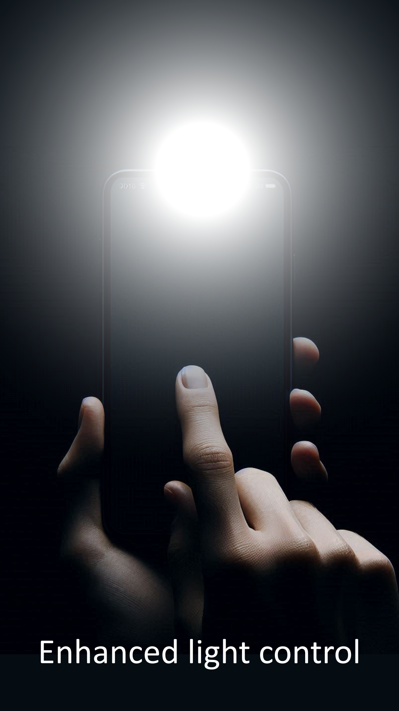

# Touch Torch

## App logo

## Description
This is a simple Flutter/Dart-based mobile app: You touch the screen and the light turns on. The light stays on until you lift you finger off the screen!

## Why another flashlight app?
As unbelievable as it might seem, this, to our knowledge, is the first app that enables your device's flashlight as long as your finger is in contact with the screen.

## Download

Or download the latest APK from the [Releases Section](https://github.com/SoftcodingForYou/touchtorch/releases/latest).

## Code structure
The whole app is written with less than 100 lines of Flutter/Dart code.

.lib >
1. main.dart: app entry point: initializes app and flashlight environment
2. home.dart: The single screen of the app. Contains a Stack() widget that holds background images and text

## Artwork

## License
This project is licensed under the BSD 3-Clause License. See the [LICENSE](LICENSE) file for details.

TL;DR: Do whatever you want with the code!
